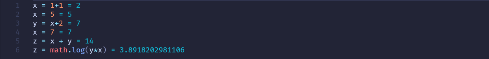
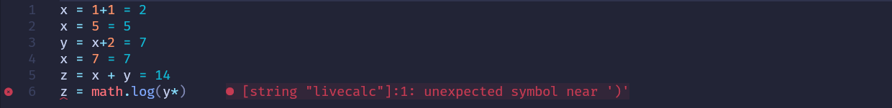
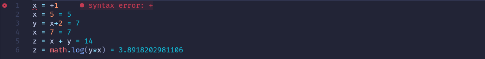
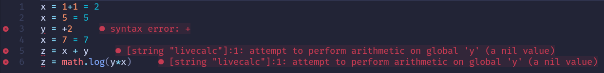

# livecalc.nvim

Evaluate expressions in real-time inside Neovim.

> [!CAUTION]
>
> This plugin evaluates Lua code directly from your buffer.
> This means it can execute arbitrary Lua code and **may be unsafe** if used
> with untrusted files.
>
> I try to mitigate this by running code in an environment with access to only
> the `math` library, but not sure if that's enough to be truly safe.
>
> Use at your own risk.

## Demo







## Features

- Live evaluation
- Inline results
- Error diagnostics

## Usage

```lua
require("livecalc").setup()
```

## Setup

### Filetype

You need to register the `livecalc` filetype manually:

```lua
vim.filetype.add({
  extension = {
    lc = "livecalc",
  },
})
```

### Treesitter (syntax highlighting)

Until a custom DSL is implemented, you can reuse Lua highlighting:

```lua
vim.treesitter.language.register("lua", "livecalc")
```

### Limitations

For simplicity I use Lua's treesitter parser so `livecalc` has uses the
exact same syntax as Lua, which is not the best for this use case.
It also has a lot of unnecessary syntax which causes some issues. To
avoid some of this issues I only evaluate single line assignment expressions.

### Planned

- Allow creating and calling functions.
- Custom DSL with a more ergonomic syntax.
  - Allow specifying value units.
  - Display units after evaluation.

```lc
@unit m,s

1 + 1 `= 2`

x = (1 + 1) [m] `= 2 [m]`
y = xx / 1[s] `= 4 [m²/s]`
```

- Fractional display for rational numbers.
